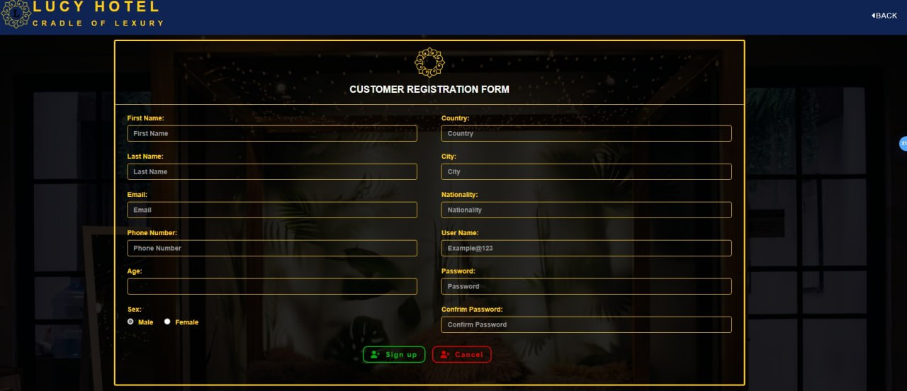

<h1 align="center">🛏 Hotel Management System 🛏</h1>

# Overview:
This PHP-based hotel management system, developed as a first project, provides a convenient online platform for guests to reserve rooms, order meals and drinks, and leave feedback. Hotel staff can manage reservations, employee information, and generate reports.

# Key Features:

- **Online room reservations**
- **Online meal and drink ordering**
- **Guest feedback and review system**
- **Employee management**
- **Report generation**
- **Meeting hall rentals**
- **Hotel information portal**

# Technologies:

- HTML
- CSS
- JavaScript
- PHP

# Development Process:

- Developed using an Agile methodology, specifically Scrum
- Utilized XAMPP for local development

# File structure
    
    ├───bootstrap
    │   ├───css
    │   └───js
    ├───Customer
    │   ├───bootstrap
    │   │   ├───css
    │   │   └───js
    │   ├───fontawesome
    │   │   ├───css
    │   │   ├───js
    │   │   ├───less
    │   │   ├───metadata
    │   │   ├───scss
    │   │   ├───sprites
    │   │   ├───svgs
    │   │   │   ├───brands
    │   │   │   ├───regular
    │   │   │   └───solid
    │   │   └───webfonts
    │   └───image
    ├───database
    ├───documentation
    ├───fontawesome    
    │   ├───css        
    │   ├───js
    │   ├───less       
    │   ├───metadata   
    │   ├───scss       
    │   ├───sprites    
    │   ├───svgs       
    │   │   ├───brands 
    │   │   ├───regular
    │   │   └───solid  
    │   └───webfonts   
    ├───food image     
    ├───forlogo        
    ├───gitimage       
    ├───image
    │   └───gallary
    └───Staff
        ├───Admin
        ├───Chefs
        ├───Manager
        └───Reception

# Usage

## Prerequisites

- **XAMPP**: Ensure XAMPP (Apache, MySQL, PHP) is installed on your system. You can download it from https://www.apachefriends.org/download.html.
- **PHP**: Make sure PHP is enabled in your XAMPP control panel.
- **MySQ**L: Set up MySQL and create a database for your project.

## Installation
### Clone the Repository:

    [git clone https://github.com/yourusername/hotel-management-system.git](https://github.com/TemesgenMeles/Hotel-Management-System-PHP-.git)
*Use code with caution.*

### Import Database:

- Open your MySQL database and import the **./database/lucy_hotel.sql** file from the database directory.

### Configure Project:

- Update the database connection details in the connection.php file.

## Running the Project 

- Start XAMPP: Start Apache and MySQL in your XAMPP control panel.
- Access the Project: Open your web browser and navigate to http://localhost/Hotel-Management-System-PHP.

# Challenges and Solutions:

- **Time constraints**: Overcame challenges due to limited time by leveraging online resources and focusing on core functionalities.
- **Lack of collaboration**: Worked independently, relying on online communities for support and problem-solving.

🤐 **Note:** *This project was developed as a first-time venture, providing valuable experience in web development and project management.*
 

